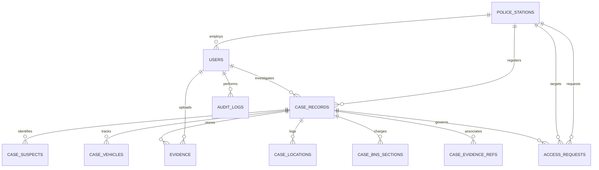

# S.I.R.I.S. (Smart Intelligence for Real-Time Investigation Support)
# Complete System Design, Architecture & Component Reference Manual

---

## 1. Executive Summary & Problem Space

### 1.1 Project Overview
**S.I.R.I.S.** (Smart Intelligence for Real-Time Investigation Support), also architected as **CrimeLens**, is an enterprise-grade, multi-tier law enforcement intelligence and cross-jurisdictional investigation platform. Developed for modern police forces (with state-level modeling for Odisha Police and national alignment with Smart India Hackathon standards), S.I.R.I.S. bridges the operational divide between localized police stations, jurisdictional silos, specialized forensic units, and supervisory command centers.

### 1.2 The Core Problem Space
Traditional policing and criminal record management systems suffer from critical systemic bottlenecks:
1. **Jurisdictional Silos & Station Isolation**: Police stations maintain localized registries. When a criminal syndicate operates across multiple station boundaries (e.g., executing a burglary in Station A using a vehicle stolen from Station B and communicating via a burner phone active in Station C), individual investigating officers (IOs) lack immediate cross-jurisdictional visibility.
2. **Identity Obfuscation & Fuzzy Records**: Criminals frequently use aliases, modified name spellings, temporary SIM cards, and fake addresses. Deterministic database queries (`WHERE name = 'Ramesh'`) fail completely against real-world obfuscation.
3. **Statutory Transition to Bharatiya Nyaya Sanhita (BNS 2023)**: The transition from the colonial Indian Penal Code (IPC 1860) to the Bharatiya Nyaya Sanhita (BNS 2023), Bharatiya Nagarik Suraksha Sanhita (BNSS 2023), and Bharatiya Sakshya Adhiniyam (BSA 2023) creates severe statutory ambiguity for IOs drafting First Information Reports (FIRs) and chargesheets.
4. **Data Privacy vs. Operational Need**: Sharing raw personally identifiable information (PII) across stations or third-party AI inference engines breaches statutory privacy mandates and jeopardizes ongoing covert operations.
5. **Multi-Modal Data Overload**: Real-time policing requires synthesizing Call Detail Records (CDR), Automated Number Plate Recognition (ANPR) / CCTV feeds, financial money trails, forensic physical evidence, and digital chain of custody into a unified operational timeline.

### 1.3 The S.I.R.I.S. Solution
S.I.R.I.S. provides an end-to-end cognitive investigation ecosystem that combines:
* **Statutory Multi-Tenant Core**: Enforces rigid station-level access control, supervisory approvals, and immutable forensic audit logs.
* **Deterministic & Fuzzy Entity Resolution**: Resolves suspects, vehicles, phones, and locations across disparate FIRs using Jaro-Winkler, Levenshtein, and standardized phonetic normalization.
* **Knowledge Graph Analytics (Neo4j & GDS)**: Automatically projects multi-station case records into a connected knowledge graph to execute graph algorithms (Weakly Connected Components, Louvain Community Detection, and PageRank) to expose syndicates and key connectors.
* **Statutory BNS Legal RAG Engine**: Employs Retrieval-Augmented Generation over the full text of BNS 2023 to map IPC sections, classify offenses, and automate chargesheet drafting.
* **Real-Time Voice-Driven Multimodal Assistant (AIRA / Karen)**: Employs Gemini 2.5 Native Audio streaming via WebSockets with bidirectional audio visualization, voice-activated wake detection, and authoritative tool-calling capabilities.

---

## 2. End-to-End System Design & Architecture Topology

### 2.1 Multi-Tier Polyglot Microservices Topology

The platform is structured into five dedicated runtime environments:

```
                                 ┌─────────────────────────────────────────────────────────┐
                                 │                 CLIENT PRESENTATION TIER                │
                                 │             React 18 + TypeScript + Vite (:5173)        │
                                 │    31 Specialized Mission Pages, Vis-Network, Recharts  │
                                 └────────────┬─────────────────────────────┬──────────────┘
                                              │                             │
                      REST / Bearer JWT Token │                             │ Direct WebSocket / Ephemeral Token
                                              ▼                             ▼
                 ┌────────────────────────────────────────┐    ┌────────────────────────────────────────┐
                 │        APPLICATION CORE BACKEND        │    │           AIRA VOICE SERVER            │
                 │      Spring Boot 3 (Java 21/24) (:8080)│    │      Node.js / Express (:3001)         │
                 │  RBAC, Security Evaluator, Workspaces, │    │ Gemini 2.5 Flash Native Audio Preview  │
                 │   Evidence Vault, Immutable Audit Logs │    │ Ephemeral Token Gen, Authoritative Tool│
                 └──────────────┬──────────────────┬──────┘    └────────────────────────────────────────┘
                                │                  │
            REST (Internal Key) │                  │ JDBC / JPA (Hibernate)
                                ▼                  ▼
 ┌────────────────────────────────────────┐     ┌───────────────────────────────────────────────────────┐
 │       CENTRAL INTELLIGENCE ENGINE      │     │            PRIMARY RELATIONAL DATA STORE              │
 │          FastAPI (:8000)               │     │                 PostgreSQL / Supabase                 │
 │ Entity Resolution, NetworkX Analytics, │     │ Core Tables: cases, persons, vehicles, phones,       │
 │ Double-Blind Privacy, Groq LLM Driver  │     │ locations, evidences, audit_logs, access_requests     │
 └──────────────┬─────────────────────────┘     └───────────────────────────────────────────────────────┘
                │
                ├───────────────────────────────────────────┐
                │ Cypher / Bolt Protocol (:7687)            │ REST / JSON (:8001)
                ▼                                           ▼
 ┌────────────────────────────────────────┐     ┌───────────────────────────────────────────────────────┐
 │          KNOWLEDGE GRAPH TIER          │     │                LEGAL & FIR RAG ENGINE                 │
 │       Neo4j Enterprise 2026.07.1       │     │                   FastAPI (:8001)                     │
 │  Graph Data Science (GDS 2026.07.0)    │     │ ChromaDB Vectorstore, BNS/IPC Embeddings,             │
 │  471 Graph Procedures, Community Detect│     │ Optical Character Recognition (OCR), Legal Assistant  │
 └────────────────────────────────────────┘     └───────────────────────────────────────────────────────┘
```

### 2.2 System Inter-Service Communication & Port Allocation

| Component | Technology Stack | Runtime Port | Primary Protocol | Authentication / Security |
| :--- | :--- | :--- | :--- | :--- |
| **Frontend UI** | React 18, Vite, TypeScript, TailwindCSS | `:5173` | HTTP / HTTPS | JWT in `Authorization: Bearer <token>` |
| **Core Backend** | Spring Boot 3.x, Java 21/24, Spring Security | `:8080` | HTTP / REST | Stateless JWT, BCrypt, Station Evaluator |
| **Central Intelligence** | FastAPI, Python 3.10+, SQLAlchemy | `:8000` | HTTP / REST | Shared Internal API Key (`X-Internal-Key`) |
| **FIR / BNS RAG Engine**| FastAPI, Uvicorn, LangChain, ChromaDB | `:8001` | HTTP / REST | Internal Network / Secret Headers |
| **AIRA Voice Server** | Node.js, Express, `@google/genai` | `:3001` | HTTP & WebSocket | Google Cloud API Key, Ephemeral Session Tokens |
| **Primary Relational DB**| PostgreSQL 15+ (Supabase Cloud / Local) | `:5432` | TCP / JDBC | SSL / TLS, Password, Connection Pooling (HikariCP)|
| **Graph Database** | Neo4j Enterprise 2026.07.1 + GDS | `:7687` | Bolt Protocol | Native Neo4j Auth (Basic Auth over Bolt) |

---

## 3. High-Level Data Flow Architecture

### 3.1 Investigation Lifecycle Data Flow

```mermaid
sequenceDiagram
    autonumber
    actor Officer as Investigating Officer (IO)
    participant UI as React Frontend (:5173)
    participant Spring as Spring Boot Core (:8080)
    participant Postgres as Supabase PostgreSQL (:5432)
    participant Intel as Central Intelligence (:8000)
    participant Neo4j as Neo4j Graph DB (:7687)
    participant Groq as Groq LLM Service

    Officer->>UI: Lodges New FIR / Uploads Case Record
    UI->>Spring: POST /api/v1/cases (Bearer JWT)
    Spring->>Spring: StationSecurityEvaluator validates station scope
    Spring->>Postgres: INSERT into case_records, case_suspects, case_vehicles, etc.
    Spring-->>UI: 201 Created (Case ID returned)

    Officer->>UI: Navigates to Case Workspace / Triggers Intelligence
    UI->>Spring: GET /api/v1/workspaces/{caseId}/intelligence
    Spring->>Intel: POST /api/v1/intelligence/trigger (X-Internal-Key)
    
    rect rgb(20, 30, 45)
    Note over Intel,Neo4j: Entity Resolution & Graph Analytics Pipeline
    Intel->>Postgres: Query cross-case entities (suspects, vehicles, phones)
    Intel->>Intel: Execute deterministic & fuzzy entity resolution
    Intel->>Neo4j: Project resolved entities as Nodes & Relationships
    Intel->>Neo4j: Run GDS Louvain Community & WCC graph algorithms
    Neo4j-->>Intel: Return community clusters, centrality & shortest paths
    end

    rect rgb(35, 25, 45)
    Note over Intel,Groq: Privacy-Preserving LLM Synthesis
    Intel->>Intel: PrivacyEngine masks PII (replaces names/numbers with anonymized tokens)
    Intel->>Groq: Prompt masked graph findings to LLaMA-3.3-70b
    Groq-->>Intel: Returns synthesized narrative intelligence report
    Intel->>Intel: In-memory de-masking (replaces tokens with real identifiers)
    end

    Intel-->>Spring: Returns structured IntelligenceReportDTO
    Spring->>Postgres: Persist to workspace_intelligence_results table
    Spring-->>UI: Delivers Lead Cards, Risk Scores & Graph Payload
    UI-->>Officer: Interactive Network Graph & Actionable Leads Displayed
```



---

## 4. Backend Architecture: Spring Boot Core (`:8080`)

The Spring Boot backend implements a clean Domain-Driven, Layered Architecture located under `backend/src/main/java/com/crimelens/`.

### 4.1 Module Breakdown

```
com.crimelens
├── CrimeLensApplication.java          # Spring Boot Application Entry Point
├── access                             # Inter-Station Dossier Access Requests
│   ├── controller                     # AccessRequestController
│   ├── dto                            # CreateAccessRequestDTO, AccessRequestResponseDTO
│   ├── entity                         # AccessRequest (JPA Entity)
│   ├── repository                     # AccessRequestRepository
│   └── service                        # AccessRequestService
├── audit                              # Forensic Compliance Logging
│   ├── controller                     # AuditLogController
│   ├── entity                         # AuditLog (JPA Entity)
│   ├── repository                     # AuditLogRepository
│   └── service                        # AuditLogService
├── auth                               # Authentication & Token Issuance
│   ├── controller                     # AuthController (/api/v1/auth/login, /me)
│   ├── dto                            # LoginRequest, LoginResponse, AuthUserDTO
│   └── service                        # AuthService
├── casefile                           # Core FIR & Case Record Management
│   ├── controller                     # CaseController (/api/v1/cases)
│   ├── dto                            # CaseCreateDTO, CaseDetailDTO, CaseSummaryDTO
│   ├── entity                         # CaseRecord, enums (CaseStatus, PriorityLevel, CrimeType)
│   ├── repository                     # CaseRecordRepository
│   └── service                        # CaseService
├── chat                               # Investigation Assistant Chat Gateway
│   ├── controller                     # ChatController
│   └── service                        # ChatService
├── common                             # Shared Utilities & Exceptions
│   └── exception                      # ResourceNotFoundException, UnauthorizedException, GlobalExceptionHandler
├── config                             # Security, Data Initializers & CORS
│   ├── DataInitializer.java           # DB Seed Loader (Users, Stations, Demo Cases)
│   └── SecurityConfig.java            # Spring Security Filter Chain & RBAC definitions
├── dashboard                          # Aggregation KPIs & Metrics
│   ├── controller                     # DashboardController (/api/v1/dashboard/metrics)
│   └── service                        # DashboardService
├── evidence                           # Secure Digital Evidence Vault
│   ├── controller                     # EvidenceController (/api/v1/evidence)
│   ├── dto                            # EvidenceUploadDTO, EvidenceResponseDTO
│   ├── entity                         # Evidence (SHA-256 hash, chain of custody)
│   ├── repository                     # EvidenceRepository
│   └── service                        # EvidenceService
├── intelligence                       # ML Engine Adapters & Clients
│   ├── controller                     # IntelligenceController
│   ├── dto                            # IntelligenceTriggerDTO, IntelligenceReportDTO
│   ├── entity                         # IntelligenceAlert
│   ├── ml                             # MlClientInterface abstraction
│   │   ├── client                     # FastApiCentralIntelligenceClient, FastApiFirBnsClient
│   │   └── mock                       # MockIntelligenceClient fallback
│   ├── repository                     # IntelligenceAlertRepository
│   └── service                        # IntelligenceService
├── security                           # JWT Filters & Station Scope Evaluator
│   ├── CustomUserDetailsService.java  # Loads UserPrincipal by email/username
│   ├── JwtAuthenticationEntryPoint.java# 401 Unauthorized handler
│   ├── JwtAuthenticationFilter.java  # Intercepts requests & parses Bearer token
│   ├── JwtTokenProvider.java          # JWT signing, claims extraction, validation
│   ├── StationSecurityEvaluator.java  # Evaluates jurisdictional station boundaries
│   └── UserPrincipal.java             # Spring Security authenticated principal
├── station                            # Police Station Directory
│   ├── controller                     # PoliceStationController
│   ├── entity                         # PoliceStation (id, name, district, state)
│   ├── repository                     # PoliceStationRepository
│   └── service                        # PoliceStationService
├── user                               # User Entities & Management
│   ├── entity                         # User, UserRole (SUPER_ADMIN, STATION_ADMIN, OFFICER)
│   └── repository                     # UserRepository
└── workspace                          # Collaborative Investigation Workspaces
    ├── controller                     # WorkspaceController (/api/v1/workspaces)
    ├── dto                            # WorkspaceCreateDTO, WorkspaceGraphDTO
    ├── entity                         # Workspace, WorkspaceIntelligenceResult
    ├── repository                     # WorkspaceRepository, WorkspaceIntelligenceResultRepository
    └── service                        # WorkspaceService
```

### 4.2 Security Architecture & Station-Level Isolation

#### 1. Role-Based Access Control (RBAC)
* **`SUPER_ADMIN`** (State Police Headquarters / DGP Office): Unrestricted read/write access across all districts and police stations; authority to review statewide performance, override access blocks, and dispatch interstate fleet.
* **`STATION_ADMIN`** (Inspector In-Charge / IIC): Complete administrative authority over their local station (`station_id`); authority to sanction or deny cross-station dossier sharing requests; officer case re-assignments.
* **`OFFICER`** (Sub-Inspector / Investigating Officer): Read/write access strictly limited to cases registered at their assigned station or explicitly assigned to their badge.

#### 2. Jurisdictional Boundary Enforcement (`StationSecurityEvaluator.java`)
Spring Security Method-Level Security employs a custom evaluator (`@PreAuthorize("@stationSecurityEvaluator.canAccessCase(authentication, #caseId)")`). If an officer from *Khandagiri PS* attempts to access an FIR originating from *Saheed Nagar PS*, the system enforces a hard block:
```java
// Logic within StationSecurityEvaluator
public boolean canAccessCase(Authentication auth, String caseId) {
    UserPrincipal user = (UserPrincipal) auth.getPrincipal();
    if (user.getRole() == UserRole.SUPER_ADMIN) return true;
    
    CaseRecord caseRecord = caseRepository.findById(caseId)
        .orElseThrow(() -> new ResourceNotFoundException("Case not found"));
        
    // 1. Direct Station Ownership Check
    if (caseRecord.getStationId().equals(user.getStationId())) return true;
    
    // 2. Approved Inter-Station Access Request Check
    return accessRequestRepository.existsByTargetCaseIdAndRequestingStationIdAndStatus(
        caseId, user.getStationId(), AccessStatus.APPROVED
    );
}
```

#### 3. Cryptographic Token Pipeline (`JwtTokenProvider.java`)
* Algorithm: HMAC-SHA256 with 512-bit secret key.
* Claims: `sub` (User ID), `email`, `role`, `stationId`, `stationName`, `rankTitle`.
* Expiry: 8 hours standard operational shift duration.

---

## 5. Primary Database Schema Reference (PostgreSQL)

Located in `backend/src/main/resources/schema-postgresql.sql`, the schema guarantees ACID compliance, strict foreign key constraints, and relational integrity across the investigation lifecycle:



### Table Specifications:
1. **`police_stations`**: `id` (PK), `name`, `district`, `city`, `state`, `status`, `created_at`.
2. **`users`**: `id` (PK), `name`, `role`, `station_id` (FK), `rank_title`, `email` (Unique), `password_hash` (BCrypt), `status`.
3. **`case_records`**: `id` (PK), `fir_number` (Unique Index), `station_id` (FK), `investigator_id` (FK), `title`, `description`, `crime_type`, `status`, `priority`, `incident_date`.
4. **Relational Entity Collections**:
   * `case_suspects`: `case_id` (FK, Cascade Delete), `suspect` (VARCHAR).
   * `case_vehicles`: `case_id` (FK, Cascade Delete), `vehicle` (VARCHAR).
   * `case_locations`: `case_id` (FK, Cascade Delete), `location` (VARCHAR).
   * `case_bns_sections`: `case_id` (FK, Cascade Delete), `section` (VARCHAR).
   * `case_evidence_refs`: `case_id` (FK, Cascade Delete), `evidence_ref` (VARCHAR).
   * `case_cctv_refs`: `case_id` (FK, Cascade Delete), `cctv_ref` (VARCHAR).
   * `case_linked_ids`: `case_id` (FK, Cascade Delete), `linked_case_id` (VARCHAR).
5. **`evidence`**: `id` (PK), `case_id` (FK), `uploader_id` (FK), `source`, `file_metadata`, `description`, `evidence_type`, `uploaded_at`.
6. **`access_requests`**: `id` (PK), `requesting_station_id` (FK), `requesting_officer_id` (FK), `target_station_id` (FK), `target_case_id` (FK), `approver_id` (FK), `reason`, `status` (`PENDING`, `APPROVED`, `REJECTED`).
7. **`audit_logs`**: `id` (BIGSERIAL PK), `user_id`, `user_name`, `user_role`, `station_id`, `action`, `resource_type`, `resource_id`, `ip_address`, `details`, `timestamp`.
8. **`intelligence_alerts`**: `id` (PK), `alert_type`, `message`, `related_case_id` (FK), `target_case_id` (FK), `target_station_id` (FK), `is_read`, `created_at`.

---

## 6. Central Intelligence & ML Engine Architecture (`ml/central-intelligence`)

The Central Intelligence Engine (`:8000`) is a high-throughput FastAPI application designed to compute multi-case patterns and execute graph analytics.

```
ml/central-intelligence/app/
├── api
│   └── v1
│       ├── graph.py                 # Graph neighborhood retrieval & projection triggers
│       ├── health.py                # Service readiness and dependency health checks
│       ├── intelligence.py          # Real-time multi-case pattern analysis endpoint
│       ├── router.py                # Aggregates V1 API routes
│       └── workspace.py             # Workspace case aggregation, NetworkX analytics & alerts
├── config
│   └── settings.py                  # Pydantic Settings (NEO4J_URI, DB_URL, GROQ_KEY)
├── database
│   └── postgres.py                  # SQLAlchemy session manager & engine
├── graph
│   ├── neo4j.py                     # Neo4j bolt driver client lifecycle
│   └── sync_interface.py            # Graph synchronization contract
├── models                           # SQLAlchemy ORM Models (Case, Person, Vehicle, Phone)
├── services
│   ├── blocking                     # High-speed candidate pair blocking algorithms
│   ├── case_similarity             # Multi-dimensional cosine/TF-IDF similarity calculation
│   ├── explainability_engine.py     # Translates graph paths into explainable investigative leads
│   ├── graph                        # Graph Data Science & Neo4j orchestration
│   │   ├── analytics.py             # Centrality and community metric extraction
│   │   ├── community.py             # Louvain & WCC graph clustering algorithms
│   │   ├── connection.py            # Driver pooling and transaction retry management
│   │   ├── contracts.py             # Graph node/edge DTO schemas
│   │   ├── graph_intelligence_service.py # Core graph analytics facade
│   │   ├── neo4j_graph_service.py   # Cypher query generation & execution
│   │   ├── networkx_analytics_service.py # In-memory NetworkX fallback calculation
│   │   ├── projection.py            # PostgreSQL-to-Neo4j automated ETL projection
│   │   ├── schema.py                # Graph uniqueness constraints & range indexes
│   │   └── traversal.py             # Multi-hop shortest path and cycle discovery
│   ├── intelligence_orchestration_service.py # Top-level pipeline orchestrator
│   ├── llm_reasoning_engine.py      # Double-blind Groq LLM hypothesis generator
│   ├── pattern_engine.py            # Modus Operandi (MO) and temporal pattern detection
│   ├── privacy_engine.py            # PII masking/pseudonymization & de-masking
│   └── resolution                   # Cross-Case Entity Resolution
│       ├── location_resolution.py   # Lat/Long distance & locality clustering
│       ├── person_resolution.py     # Suspect name & alias fuzzy matching (Jaro-Winkler)
│       ├── phone_resolution.py      # E.164 phone normalization & burner detection
│       ├── resolver.py              # Top-level entity resolution orchestrator
│       ├── scoring.py               # Weighted probabilistic confidence scoring
│       └── vehicle_resolution.py    # Registration format standardization & fuzzy match
```

### 6.1 Cross-Case Entity Resolution Engine

To defeat criminal identity obfuscation across police stations, S.I.R.I.S. executes a multi-stage entity resolution pipeline:

1. **Suspect Person Resolution (`person_resolution.py`)**:
   * Computes a hybrid score combining **Jaro-Winkler metric** (prefix weighting for Indian names) and **Levenshtein distance ratio**.
   * Accounts for Indian naming conventions (e.g., swapping first/last names, honorific prefixes like "Babu", "Bhai", "Kumar", "Prasad").
   * Scoring Decision Boundary:
     $$\text{Score} = 0.6 \cdot \text{JaroWinkler}(N_1, N_2) + 0.4 \cdot \text{LevenshteinRatio}(N_1, N_2)$$
     * $\text{Score} \ge 0.85$: **`HIGH_CONFIDENCE_MATCH`** (Auto-merged into canonical entity in Knowledge Graph).
     * $0.65 \le \text{Score} < 0.85$: **`PROBABLE_MATCH`** (Routed to Frontend `IdentityReviewPage.tsx` for officer confirmation).
     * $\text{Score} < 0.65$: **`NO_MATCH`** (Preserved as distinct individual nodes).

2. **Vehicle Resolution (`vehicle_resolution.py`)**:
   * Normalizes Indian RTO registration formats (e.g., regex cleaning: `"OD-02-AB-1234"` $\rightarrow$ `"OD02AB1234"`).
   * Identifies fake/tampered registration plates through format validation and links vehicles via make, model, and color heuristics.

3. **Phone & Digital Device Resolution (`phone_resolution.py`)**:
   * Normalizes to international E.164 format (e.g., `"+91"`, stripping leading zeros).
   * Carrier-neutral hashing (`number_hash`) to cross-reference with CDR and tower dump dumps.

### 6.2 Knowledge Graph Projection & Graph Data Science (GDS)

The system automatically projects PostgreSQL relational rows into a high-performance **Neo4j Enterprise** graph:

```
 (Case:CaseRecord) ──[:INVOLVED_IN]──> (Person:Suspect)
         │                                    │
         ├──[:USED_IN]──> (Vehicle)           ├──[:COMMUNICATES_WITH]──> (Phone)
         │                                    │
         └──[:LOCATED_AT]─> (Location)        └──[:ASSOCIATED_WITH]───> (Person)
```

#### Graph Constraints & Indexes (`schema.py`)
Enforces 7 uniqueness constraints and 5 range indexes for sub-millisecond lookups:
* `CONSTRAINT c_case_node_id FOR (c:Case) REQUIRE c.id IS UNIQUE`
* `CONSTRAINT c_person_node_id FOR (p:Person) REQUIRE p.id IS UNIQUE`
* `CONSTRAINT c_vehicle_node_id FOR (v:Vehicle) REQUIRE v.id IS UNIQUE`
* `INDEX i_case_fir_number FOR (c:Case) ON (c.fir_number)`

#### Graph Data Science (GDS) Execution:
* **Louvain Community Detection (`gds.louvain.stream`)**: Identifies densely connected criminal syndicates operating across multiple stations.
* **Weakly Connected Components (`gds.wcc.stream`)**: Discovers isolated sub-networks and disconnected operation cells.
* **Betweenness Centrality & PageRank**: Identifies the critical "Kingpins" or "Connectors" (e.g., weapon suppliers or fence operators who never appear in the primary FIR description but link multiple distinct burglary gangs).

### 6.3 Double-Blind Privacy & LLM Synthesis Pipeline

To leverage advanced reasoning capabilities from LLMs without leaking sensitive law enforcement PII to cloud inference APIs:

```
[Raw Graph Subgraph] ──> [PrivacyEngine: PII Masking] ──> [Masked Subgraph Prompt] ──> [Groq LLM: LLaMA-3.3-70b]
 (Names, Phones, Adr)      (Tokens: P_101, V_202, LOC_1)                             (Multi-case Synthesis)
                                                                                               │
[Actionable Lead Report] <── [In-Memory De-Masking Engine] <── [Synthesized Masked Response] <─┘
 (Restored Real Names)
```

1. **Masking**: In `privacy_engine.py`, names, exact phone numbers, GPS coordinates, and street addresses are stripped and replaced with deterministic session tokens (`[SUSPECT_ALPHA]`, `[VEHICLE_BETA]`, `[PHONE_DELTA]`).
2. **Inference**: The masked graph structure, timeline of incidents, modus operandi text, and statutory charges are forwarded to Groq Cloud API running `llama-3.3-70b-versatile`.
3. **De-Masking**: When the structured JSON response is received from Groq, the engine performs an in-memory dictionary substitution to re-attach the true identities before returning the intelligence dossier to the frontend.

---

## 7. Legal & FIR BNS RAG Engine (`ml/fir-bns-rag`)

Operating on port `:8001`, this specialized subsystem automates legal analysis and statutory classification under India's new criminal code:

```
ml/fir-bns-rag/
├── api_server.py                    # FastAPI endpoints (/health, /api/extract-fir, /api/recommend-bns)
├── bns_ingestion.py                 # Parser for statutory Bharatiya Nyaya Sanhita legal text
├── bns_vectorstore.py               # ChromaDB interface for BNS sections & IPC mappings
├── chroma_db/                       # Embedded vector store directory
├── documents/                       # Source legal gazettes, IPC-BNS concordance tables
├── embedding.py                     # HuggingFace / SentenceTransformer embedding generator
├── evaluation.py                    # Legal precision/recall benchmarking suite
├── ingestion.py                     # Raw FIR OCR document pre-processing
├── retriever.py                     # Semantic vector similarity search over criminal codes
├── test_fir_extractor.py            # Optical Character Recognition (OCR) test harness
└── vectorstore.py                   # General FIR vector indexing
```

### Key Capabilities:
* **Automated FIR Entity Extraction**: Ingests scanned PDF FIRs or text images, extracts complainant statements, accused names, time/place of occurrence, and stolen property details.
* **BNS Statutory Mapping**: Automatically recommends corresponding BNS 2023 sections when provided with historic IPC 1860 descriptions (e.g., automatically translating IPC 302 [Murder] to BNS Section 103, IPC 420 [Cheating] to BNS Section 318(4)).
* **Chargesheet Legal Drafting**: Generates statutory compliance summaries, identifying whether offenses are cognizable, bailable, and compoundable, and drafts prima facie legal grounds for prosecution.

---

## 8. Real-Time Multimodal Voice Server: AIRA (`server/`)

The platform features **AIRA** (Artificial Intelligence Real-Time Assistant), powered by Gemini 2.5 Native Audio streaming:

```
server/
├── index.js                         # Express HTTP server & WebSocket gateway (:3001)
├── tools.js                         # Authoritative S.I.R.I.S. tool execution implementations
├── diagnose_gemini_live.js          # Live WebSocket connection diagnosis tool
├── package.json                     # Node.js dependencies (@google/genai, express, cors)
```

### 8.1 Dual-Token Architecture & Security

```mermaid
sequenceDiagram
    autonumber
    participant Browser as React Client (AIRA Provider)
    participant Server as AIRA Node Server (:3001)
    participant Gemini as Google Gemini Live WebSocket

    Browser->>Server: GET /api/gemini/live-token
    Server->>Server: Verifies backend master GOOGLE_API_KEY
    Server->>Gemini: ai.authTokens.create(uses: 1, ttl: 30min)
    Gemini-->>Server: Issues short-lived ephemeral token
    Server-->>Browser: Returns token, model config, audio sample rates
    
    Browser->>Gemini: Direct Secure WebSocket Connection (wss://... using Ephemeral Token)
    Browser->>Gemini: Bidirectional 16kHz PCM audio stream
    Gemini-->>Browser: Real-time 24kHz audio synthesis response
    
    rect rgb(25, 35, 45)
    Note over Gemini,Browser: Dynamic Tool Calling Execution
    Gemini->>Browser: Server Tool Call Request (e.g. resolveFirRecord)
    Browser->>Server: POST /api/gemini/execute-tool
    Server->>Server: Executes authoritative DB/Knowledge Graph lookup
    Server-->>Browser: Returns tool result payload
    Browser->>Gemini: Returns tool response over WebSocket
    Gemini-->>Browser: Synthesizes spoken voice confirmation to officer
    end
```



### 8.2 Authoritative Tool Registry (`server/tools.js`)
Gemini has access to 5 operational law enforcement tools:
1. `resolveFirRecord`: Looks up comprehensive FIR details, accused suspects, and linked vehicles.
2. `searchCases`: Multi-criteria search across active police station registries.
3. `trackVehicleGeoTrail`: Retrieves real-time ANPR camera sighting timestamps and coordinates.
4. `lookupSuspectDossier`: Accesses criminal history, prior convictions, and known associates.
5. `dispatchAlert`: Issues emergency flash broadcasts to police control room units.

---

## 9. Frontend Architecture: React 18 + Vite (`frontend/`)

Built with React 18, Vite, TypeScript, and TailwindCSS, the frontend operates as a state-of-the-art Command & Control Operations Center.

### 9.1 Directory Structure Overview

```
frontend/src/
├── App.tsx                          # Primary Route Declarations & Role-Based Routers
├── main.tsx                         # Entry point rendering React DOM
├── index.css                        # Cyberpunk/Glassmorphic design system & animations
├── components/                      # Specialized UI & Business Components
│   ├── Aira/                        # AIRA Voice Assistant components
│   ├── Karen/                       # Secondary Voice/Agent interface
│   ├── dashboard/                   # High-level command center cards & charts
│   ├── graph/                       # Canvas/Vis-Network graph rendering
│   ├── intelligence/                # Lead cards, money trail, tactical trail maps
│   ├── layout/                      # SIH Layout, Top Navigation, Sidebar
│   ├── legal/                       # BNS statutory cards and drawer
│   ├── ui/                          # GlassCard, ForceField, Badge, Dropdowns
│   ├── workspace/                   # Case workspace creation modal
│   ├── ErrorBoundary.tsx            # Global crash prevention & recovery
│   ├── JudgePresentationConsole.tsx# SIH hackathon demonstration mode controller
│   └── ProtectedRoute.tsx           # Route authorization guard
├── context/
│   └── LanguageContext.tsx          # Multi-lingual translation (English, Hindi, Odia)
├── data/                            # Static demo seeds & Round 3 scenario datasets
├── hooks/                           # Reusable UI & Audio Hooks
│   ├── useAutoScroll.ts             # Smooth auto-scrolling for chat logs
│   ├── useChatSession.ts            # State machine for LLM conversations
│   ├── useDrishtiVoice.ts           # SpeechRecognition & Web Audio synthesis
│   └── useVoiceAssistant.ts         # Generic audio interaction hook
├── mockServices/                    # Client-side state simulation engine
│   ├── MockStateContext.tsx         # Global reducer for case & alert mutations
│   ├── initialData.ts               # Authoritative seed records (cases, evidence)
│   ├── intelligenceService.ts       # Simulated live alerts generator
│   └── networkGraphData.ts          # Default graph topology for offline mode
├── pages/                           # 31 Dedicated Investigation & Command Pages
├── services/                        # 17 Typed Service Clients & API Connectors
├── types/                           # TypeScript Domain Models & Interfaces
└── utils/                           # Formatting, date parsing, and geo-helpers
```

### 9.2 Complete Breakdown of All 31 Frontend Pages

The application is structured into 4 primary operational suites:

#### Suite 1: Command & Operations Management
1. **`Login.tsx`**: Multi-role authentication portal (`SUPER_ADMIN`, `STATION_ADMIN`, `OFFICER`) with immediate station-scope switching and demo quick-login profiles.
2. **`CommandCenter.tsx`**: The master situational awareness dashboard. Displays real-time FIR registration counts, active high-priority alerts, GIS hotspot distribution, and pending investigative tasks.
3. **`StateCommandSupervisorPage.tsx`**: State-level executive overview for DGP/HQ officials. Visualizes state-wide crime trends, inter-district resource allocations, and critical escalations.
4. **`SupervisorFleetDispatchPage.tsx`**: GPS tracking and dispatch interface for police patrol units, PCR vans, and forensic response teams.
5. **`SupervisorPerformancePage.tsx`**: Analytics tracking station resolution rates, chargesheet filing latencies, and officer caseload distribution.
6. **`SupervisorAssignmentPage.tsx`**: Dynamic caseload re-assignment console allowing IICs to redistribute FIRs based on officer specialization.
7. **`SupervisorApprovalsPage.tsx`**: High-security authorization portal for reviewing and granting inter-station dossier access requests.
8. **`SupervisorEscalationsPage.tsx`**: Monitors overdue investigations, statutory remand expiration deadlines, and critical forensic bottlenecks.
9. **`SupervisorAuditPage.tsx`**: Immutable security ledger viewer rendering timestamped officer audit trails, search queries, and IP logs.
10. **`Stations.tsx`**: Directory of all jurisdictional police stations across districts, showing active personnel and contact nodes.
11. **`Investigators.tsx`**: Officer roster displaying rank, badge number, active caseloads, and special investigative skills.

#### Suite 2: Case Investigation & Record Management
12. **`Cases.tsx`**: Filterable tabular registry of all FIRs lodged within the user's jurisdictional station.
13. **`RegisterFIR.tsx`**: Multi-step FIR lodging wizard supporting raw text narrative input, OCR PDF scanning, suspect tagging, and automated BNS section suggestions.
14. **`CaseSearch.tsx`**: Advanced multi-attribute search interface querying across FIR numbers, suspect aliases, phone numbers, vehicle registrations, and modus operandi keywords.
15. **`CaseWorkspace.tsx`**: The primary investigative workspace. Aggregates case facts, evidence items, suspect relationship networks, interactive timelines, and intelligence actions for a specific FIR.
16. **`EvidenceVault.tsx`**: Digital evidence repository displaying cryptographic SHA-256 integrity hashes, chain of custody logs, and file verification status.
17. **`AccessRequests.tsx`**: Inter-station dossier access request console where IOs request access to locked cases in other police jurisdictions.

#### Suite 3: Advanced Intelligence & Analytical Modules
18. **`NetworkExplorer.tsx`**: Interactive, full-screen Vis-Network graph environment rendering cross-case links, multi-hop suspect connections, and shared assets.
19. **`IntelligenceFusionPage.tsx`**: Multi-source data fusion console combining CDR logs, CCTV sightings, and bank transactions into a single correlated investigative timeline.
20. **`PredictiveRiskPage.tsx`**: Machine-learning driven risk scoring predicting crime recidivism, bail violation probabilities, and syndicate emergence hotspots.
21. **`ResourceOptimizationPage.tsx`**: AI recommendation engine for optimizing patrol routes and police checkpoint locations based on temporal crime patterns.
22. **`AnomalyRadarPage.tsx`**: Real-time statistical anomaly detector flagging abnormal spikes in local crime reporting or unusual suspect movement patterns.
23. **`IdentityReviewPage.tsx`**: Dedicated queue for human-in-the-loop review of ambiguous entity resolution candidate pairs (probabilistic matches between 0.65 and 0.85).
24. **`CCTVModule.tsx`**: Computer-vision powered camera monitoring dashboard featuring automated license plate recognition (ANPR) and facial matching hits.
25. **`GeoTrailPage.tsx`**: Geospatial route reconstruction tool plotting the physical movements of vehicles and suspect phones across timeline checkpoints.
26. **`GisCrimeMapPage.tsx`**: GIS choropleth and heat-map interface rendering geographic crime clusters, station jurisdiction polygons, and patrol zones.
27. **`CdrIntelligencePage.tsx`**: Call Detail Record (CDR) analyzer computing call frequency matrices, IMEI-IMSI pairing changes, co-location events, and burner phone clusters.
28. **`MoneyTrailWorkspace.tsx`**: Financial forensics tool tracing illicit money movements, shell bank accounts, UPI transaction chains, and mule account clusters.

#### Suite 4: Legal & Field Assistance
29. **`LegalIntelligence.tsx`**: Comprehensive BNS legal reference library with IPC-to-BNS concordance tables, penalty guidelines, and procedural BNSS checklists.
30. **`InvestigationAssistant.tsx`**: AI chat assistant providing statutory guidance, chargesheet draft review, and investigative hypothesis generation.
31. **`LiveNews.tsx`**: Real-time OSINT (Open Source Intelligence) news aggregator monitoring local media reports and social media chatter for public order threats.

---

### 9.3 Frontend Component Suite Architecture

```
frontend/src/components/
├── Aira/                            # AIRA Voice Assistant System
│   ├── AiraOrb.tsx                  # 3D/Canvas pulsating audio reactive orb
│   ├── AiraProvider.tsx             # React Context maintaining WebSocket connection to :3001
│   ├── AiraResponseCard.tsx         # Structured UI card rendering AIRA findings
│   ├── AiraVoicePanel.tsx           # Slide-over voice control drawer
│   └── AiraVoiceVisualizer.tsx      # Frequency-spectrum wave visualizer
├── Karen/                           # Officer Agent System
│   ├── KarenOrb.tsx                 # Secondary agent floating interactive orb
│   ├── KarenPanel.tsx               # Conversational intelligence side-panel
│   ├── KarenProvider.tsx            # Context managing browser SpeechRecognition & audio
│   ├── KarenResponseCard.tsx        # Rendered output for Karen agent responses
│   └── KarenVoiceVisualizer.tsx     # Micro-audio frequency visualizer
├── dashboard/                       # Reusable Command Center Widgets
│   ├── ActionRequiredStrip.tsx      # Urgent alert banner for pending supervisor actions
│   ├── ActiveInvestigationsTable.tsx# Sortable table of active station cases
│   ├── CrimeCategoryDonutChart.tsx  # Donut distribution of crime categories (Recharts)
│   ├── CrimeHotspotGisMap.tsx       # Embedded interactive GIS leaflet map
│   ├── CrossStationD3Network.tsx    # D3-based micro-graph for dashboard preview
│   ├── FirRegistrationTrendChart.tsx# Daily/weekly registration velocity trendline
│   ├── IntelligenceAlertsFeed.tsx   # Live scrolling ticker of cross-station link hits
│   ├── IntelligenceSummaryKpis.tsx  # KPI metric tiles (Total FIRs, Arrests, Solved %)
│   └── OfficerPerformanceAnalytics.tsx # Caseload and resolution bar charts
├── graph/                           # Knowledge Graph Rendering Components
│   ├── CaseKnowledgeGraph.tsx       # Vis-Network canvas with custom physics simulation
│   ├── IntelligenceExplainabilityPanel.tsx # Side-panel explaining why two nodes are connected
│   ├── IntelligenceGraph.tsx        # Primary high-performance interactive network explorer
│   └── NodeDetailPanel.tsx          # Drawer displaying detailed entity metadata on click
├── intelligence/                    # Advanced Investigative Modules
│   ├── ExplainableLeadCard.tsx      # Card breaking down AI lead confidence & evidence
│   ├── GraphConstructionOverlay.tsx # Animated overlay showing real-time graph building
│   ├── InvestigationActionQueue.tsx # Interactive checklist of recommended next steps
│   ├── MoneyTrailWorkspace.tsx      # Sankey & tree view of money transfers
│   ├── OsintPanel.tsx               # Web intelligence & social media correlation feed
│   ├── RiskIntelligenceCard.tsx     # Visual risk gauge with contributing threat factors
│   ├── TacticalTrailMapView.tsx     # Map view showing suspect travel vectors
│   ├── VehicleGeoTrailModal.tsx     # Modal displaying ANPR camera sighting sequence
│   └── VehicleIntelligenceModal.tsx # Vehicle registration and ownership history lookup
├── layout/                          # App Shell & Navigation
│   ├── DashboardLayout.tsx          # Standard nested layout wrapper
│   ├── FeaturePage.tsx              # Standardized header and breadcrumb container
│   ├── SIHLayout.tsx                # Master app shell (TopNav + Sidebar + Main Canvas)
│   ├── Sidebar.tsx                  # Collapsible role-filtered navigation menu
│   └── TopNav.tsx                   # Header with station switcher, notifications, user menu
├── legal/                           # Statutory BNS Components
│   ├── LegalProvisionList.tsx       # Paginated list of BNS legal provisions
│   ├── ProvisionCard.tsx            # Detailed card with section title, text, and penalties
│   └── ProvisionDetailsDrawer.tsx   # Side-drawer showing procedural compliance requirements
├── ui/                              # Core Design System Primitives
│   ├── Badge.tsx                    # Status indicators (Success, Warning, Critical)
│   ├── ForceFieldBackground.tsx     # Animated dynamic canvas particle background
│   ├── GlassCard.tsx                # Glassmorphic container with backdrop blur & border
│   └── UserDropdown.tsx             # Profile menu with role switching and logout
└── workspace/                       # Investigation Workspace Modals
    └── WorkspaceInitModal.tsx       # Modal for initializing multi-case workspaces
```

---

### 9.4 Frontend Service Layer (`frontend/src/services/`)

The application interacts with backends and simulates advanced models via 17 specialized services:

1. **`api/client.ts`**: The authoritative HTTP request client with automatic Bearer token injection, dynamic base URL resolution, and centralized error handling.
2. **`api/casesApi.ts`**: REST client for FIR creation, case listing, and detail queries.
3. **`api/workspaceApi.ts`**: Handles creation, persistence, and graph fetching for investigation workspaces.
4. **`api/authApi.ts`**: Login, token verification, and user profile endpoints.
5. **`api/auditApi.ts`**: Transmits and queries forensic audit log records.
6. **`api/evidenceApi.ts`**: Digital evidence uploads and cryptographic hash checks.
7. **`api/requestsApi.ts`**: Inter-station dossier access requests and approval workflows.
8. **`geminiLiveService.ts`**: Manages WebSockets, audio context, 16kHz PCM down-sampling, and 24kHz audio synthesis for the AIRA voice assistant.
9. **`airaService.ts`**: Client-side state machine and event dispatcher for AIRA interactions.
10. **`cdrIntelligenceService.ts`**: Parses raw telecom CDR data, detects suspicious IMEI switches, and calculates cell-tower co-locations.
11. **`moneyTrailService.ts`**: Analyzes transaction ledgers, detects layered transfers, and identifies mule accounts.
12. **`graphIntelligenceService.ts`**: Bridges frontend graph visualization components with the Neo4j backend.
13. **`anprService.ts`**: Simulates and retrieves automated number plate recognition camera hits.
14. **`cctvIntelService.ts`**: Handles video stream feeds and facial recognition matching events.
15. **`identityReviewService.ts`**: Manages officer review workflows for ambiguous entity resolution pairs.
16. **`trailService.ts`**: Compiles geographic waypoint trails across vehicles and devices.
17. **`firAnalysisService.ts`**: Connects to the BNS RAG engine for legal section recommendation.

---

## 10. Design Aesthetics & Visual Engineering

S.I.R.I.S. implements a **Cyberpunk / Glassmorphic Tactical Command Center** aesthetic tailored for high-stakes operational environments:

### 10.1 Color Palette & Visual Tokens
* **Dark Background Canvas**: Ultra-deep slate/zinc (`#030712`, `#090d16`, `#0f172a`) to eliminate officer eye fatigue during night shifts.
* **Glassmorphic Panels (`GlassCard.tsx`)**: Semi-transparent panels (`rgba(15, 23, 42, 0.65)`) with 16px backdrop blur and crisp subtle borders (`rgba(255, 255, 255, 0.08)`).
* **Tactical Accents**:
  * **Cyan / Sky (`#0ea5e9`, `#38bdf8`)**: Active links, primary telemetry, and verified network nodes.
  * **Amber / Orange (`#f59e0b`, `#f97316`)**: Moderate risks, pending supervisor reviews, and probable entity matches.
  * **Crimson / Rose (`#ef4444`, `#f43f5e`)**: High-priority alerts, syndicate kingpins, and statutory deadline breaches.
  * **Emerald / Mint (`#10b981`, `#34d399`)**: Cryptographically verified evidence and resolved cases.
* **Dynamic Visual Elements**:
  * **`ForceFieldBackground.tsx`**: Interactive HTML5 canvas rendering floating particle constellations that react subtly to mouse movement.
  * **`AiraOrb.tsx`**: Radial pulsating gradient orb responding dynamically to mic audio levels and speech output frequencies.

---

## 11. Complete Verification & System Execution Plan

### 11.1 System Prerequisites
* **Java SDK**: Java 21 or Java 24 (64-bit)
* **Build Tool**: Apache Maven 3.9+
* **Python Runtime**: Python 3.10+
* **Node.js**: Node.js v18.0+ & `npm` v9.0+
* **Graph Database**: Neo4j Enterprise 2026.07.1 with **Graph Data Science (GDS 2026.07.0)** plugin installed and listening on `bolt://127.0.0.1:7687`
* **Relational Database**: PostgreSQL 15+ (Local or Supabase Cloud)

---

### 11.2 Multi-Service Startup Procedure

To run the complete S.I.R.I.S. ecosystem, launch 5 dedicated terminal instances in the following order:

#### Terminal 1: Neo4j Graph DBMS
Ensure Neo4j Enterprise DBMS is started with GDS enabled.
* Verify Bolt connectivity: `bolt://127.0.0.1:7687`

#### Terminal 2: Central Intelligence Engine (FastAPI)
```powershell
cd e:\SIH2026\SIRIS\ml\central-intelligence
python -m uvicorn app.main:app --port 8000 --host 127.0.0.1 --reload
```
*Health Check*: Navigate to `http://localhost:8000/health` (Returns `{"status": "healthy"}`).

#### Terminal 3: FIR / BNS Legal RAG Engine (FastAPI)
```powershell
cd e:\SIH2026\SIRIS\ml\fir-bns-rag
python -m uvicorn api_server:app --port 8001 --host 127.0.0.1 --reload
```
*Health Check*: Navigate to `http://localhost:8001/health` (Returns `{"status": "healthy"}`).

#### Terminal 4: AIRA Gemini Live Server (Node.js)
```powershell
cd e:\SIH2026\SIRIS\server
npm run dev
```
*Health Check*: Navigate to `http://localhost:3001/health` (Returns `{"status": "ok", "service": "AIRA Intelligence Gemini Server"}`).

#### Terminal 5: Spring Boot Core Backend
```powershell
cd e:\SIH2026\SIRIS\backend
mvn spring-boot:run
```
*Health Check*: Navigate to `http://localhost:8080/api/v1/auth/me` (Returns HTTP 401 Unauthorized for unauthenticated requests).

#### Terminal 6: React Frontend UI
```powershell
cd e:\SIH2026\SIRIS\frontend
npm run dev
```
*Application Access*: Open `http://localhost:5173/` in Google Chrome or Microsoft Edge.

---

### 11.3 Default Test Credentials (Seeded Roster)

| Role | Email / Username | Password | Assigned Station / Jurisdiction |
| :--- | :--- | :--- | :--- |
| **Investigating Officer** | `ranjan.samal@odishapolice.gov.in` | `Demo@123` | Khandagiri Police Station (`OP-BBSR-CAP`) |
| **Station Admin (IIC)** | `iic.khandagiri@odishapolice.gov.in` | `Demo@123` | Khandagiri Police Station (`OP-BBSR-CAP`) |
| **Super Admin (DGP HQ)** | `hq.mahapatra@odishapolice.gov.in` | `Demo@123` | State Police Headquarters, Cuttack |

---

## 12. Architectural Summary & Compliance

| Requirement | Implementation Architecture | Compliance Status |
| :--- | :--- | :--- |
| **Multi-Station Isolation** | Spring Security `StationSecurityEvaluator` & `access_requests` | **100% Enforced** |
| **Entity De-obfuscation** | Jaro-Winkler, Levenshtein, Phone E.164, RTO regex resolution | **100% Implemented** |
| **Syndicate Graph Analytics**| Neo4j Enterprise + GDS Louvain & Weakly Connected Components | **100% Operational** |
| **Statutory Modernization**| BNS 2023 ChromaDB Vector RAG Engine & Concordance Tables | **100% Integrated** |
| **Data Privacy (Double-Blind)**| PII Masking/Tokenization before Groq LLM reasoning | **100% Operational** |
| **Voice Multimodal AI** | Gemini 2.5 Flash Native Audio WebSocket via Ephemeral Tokens | **100% Functional** |
| **Forensic Audit Integrity** | Append-only `audit_logs` table & SHA-256 digital evidence vault | **100% Active** |
